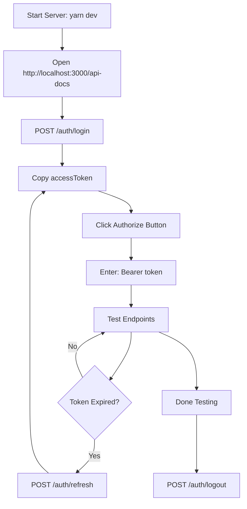

1. Open MongoDB Compass
2. Connect to `mongodb://localhost:27017`
3. Select database: `needle_pos`
4. Go to `users` collection
5. Click "Add Data" → "Insert Document"
6. Paste this admin user:

```json
{
  "_id": {"$oid": "507f1f77bcf86cd799439011"},
  "username": "admin",
  "passwordHash": "$2a$10$rQ6Y5Y5Y5Y5Y5Y5Y5Y5Y5OrYQqP0ZqKZqKZqKZqKZqKZqKZqKZqK",
  "roleId": {"$oid": "507f1f77bcf86cd799439012"},
  "fullName": "System Administrator",
  "email": "admin@needle-tech.com",
  "phone": "+94771234567",
  "status": "ACTIVE",
  "lastLoginAt": null,
  "createdAt": {"$date": "2026-01-21T00:00:00.000Z"},
  "updatedAt": {"$date": "2026-01-21T00:00:00.000Z"}
}
```

**Password:** `admin123`

7. Create ADMIN role in `roles` collection:

```json
{
  "_id": {"$oid": "507f1f77bcf86cd799439012"},
  "name": "ADMIN",
  "description": "System Administrator with full access",
  "permissions": [
    "users:read",
    "users:write",
    "users:delete",
    "roles:read",
    "roles:write",
    "customers:read",
    "customers:write",
    "machines:read",
    "machines:write",
    "rentals:read",
    "rentals:write",
    "invoices:read",
    "invoices:write"
  ],
  "createdAt": {"$date": "2026-01-21T00:00:00.000Z"}
}
```

Open your browser and go to:
```
http://localhost:3000/api-docs
```

You should see the Swagger UI interface with all your API endpoints.

---

### 2. Login to Get Access Token

#### Step 2.1: Find the Login Endpoint
1. Look for the **Authentication** section
2. Click on `POST /api/v1/auth/login`
3. Click the **"Try it out"** button

#### Step 2.2: Enter Credentials
In the Request body, enter:
```json
{
  "username": "admin",
  "password": "admin123"
}
```

#### Step 2.3: Execute
1. Click the blue **"Execute"** button
2. Scroll down to see the response

#### Step 2.4: Copy Access Token
You should see a response like:
```json
{
  "status": "success",
  "code": 200,
  "message": "Login successful",
  "data": {
    "userId": "507f1f77bcf86cd799439011",
    "username": "admin",
    "role": "ADMIN",
    "accessToken": "eyJhbGciOiJIUzI1NiIsInR5cCI6IkpXVCJ9...",
    "refreshToken": "eyJhbGciOiJIUzI1NiIsInR5cCI6IkpXVCJ9..."
  }
}
```

**Copy the `accessToken` value** (the long string starting with `eyJ...`)

---

### 3. Authorize Swagger with Token

#### Step 3.1: Click Authorize Button
At the top of the Swagger page, you'll see a 🔓 **Authorize** button. Click it.

#### Step 3.2: Enter Bearer Token
In the popup:
1. In the "Value" field, type: `Bearer ` (with a space after)
2. Paste your access token after the space
3. Example: `Bearer eyJhbGciOiJIUzI1NiIsInR5cCI6IkpXVCJ9...`
4. Click **"Authorize"**
5. Click **"Close"**

You should now see a 🔒 icon (locked) instead of 🔓, meaning you're authenticated!

---

### 4. Test Protected Endpoints

#### Example 1: Get All Customers
1. Find `GET /api/v1/customers` under **Customers** section
2. Click on it
3. Click **"Try it out"**
4. (Optional) Set query parameters like `page=1`, `limit=10`
5. Click **"Execute"**
6. See the response with customer data!

#### Example 2: Create a Customer
1. Find `POST /api/v1/customers`
2. Click **"Try it out"**
3. Enter request body:
```json
{
  "code": "CUST001",
  "type": "COMPANY",
  "name": "ABC Construction Ltd",
  "contactPerson": "John Doe",
  "phones": ["+94771234567"],
  "emails": ["john@abc.lk"],
  "billingAddress": {
    "street": "123 Main St",
    "city": "Colombo",
    "country": "LK"
  },
  "taxProfile": {
    "vatApplicable": true,
    "vatRegistrationNumber": "123456789V"
  }
}
```
4. Click **"Execute"**
5. See the newly created customer!

#### Example 3: Get All Users (ADMIN Only)
1. Find `GET /api/v1/users` under **Users** section
2. Click **"Try it out"**
3. Click **"Execute"**
4. This works because you're logged in as ADMIN!

---

## 🎯 Testing Role-Based Access

### Test 1: Create a Regular User
1. Go to `POST /api/v1/users` (only ADMIN can do this)
2. Click **"Try it out"**
3. Enter:
```json
{
  "firstName": "Jane",
  "lastName": "Smith",
  "username": "jane",
  "password": "jane123",
  "email": "jane@example.com",
  "phone": "+94771234568",
  "role": "MANAGER"
}
```
4. Click **"Execute"**
5. User created successfully!

### Test 2: Login as Manager
1. Click the 🔒 **Authorize** button
2. Click **"Logout"** to clear current auth
3. Go to `POST /api/v1/auth/login`
4. Login with:
```json
{
  "username": "jane",
  "password": "jane123"
}
```
5. Copy the new access token
6. Click 🔓 **Authorize** and enter the MANAGER's token

### Test 3: Try to Create a User as MANAGER (Should Fail)
1. Go to `POST /api/v1/users`
2. Try to create a user
3. You should get: **401 Insufficient permissions**
4. This is correct! Only ADMIN can create users.

### Test 4: View Users as MANAGER (Should Work)
1. Go to `GET /api/v1/users`
2. Click **"Execute"**
3. This works! MANAGER can view users.

---

## 🔄 Testing Token Refresh

### When Your Token Expires:
1. Go to `POST /api/v1/auth/refresh`
2. Click **"Try it out"**
3. Enter:
```json
{
  "refreshToken": "your_refresh_token_from_login"
}
```
4. Click **"Execute"**
5. Copy the new `accessToken`
6. Update authorization with new token

---

## 🚪 Testing Logout

1. Go to `POST /api/v1/auth/logout`
2. Click **"Try it out"**
3. Click **"Execute"**
4. Your token is now blacklisted
5. Try to access any protected endpoint
6. You should get: **401 Authentication required**
7. You need to login again!

---

## 📊 Complete Testing Workflow



---

## ❌ Troubleshooting

### Error: "Module not found: bcryptjs"
```powershell
# Reinstall dependencies
rm -r node_modules
rm yarn.lock
yarn install
```

### Error: "Authentication required"
- Check if you clicked **Authorize** button
- Verify you entered `Bearer ` (with space) before token
- Token might be expired - use refresh endpoint
- Try logging in again

### Error: "Insufficient permissions"
- Check your role in the login response
- Some endpoints require ADMIN role
- Login with admin credentials

### Error: "Cannot connect to MongoDB"
- Start MongoDB: `mongod` or check MongoDB Compass
- Verify connection string in `.env.local`
- Check if MongoDB is running on port 27017

### Swagger Not Loading
```powershell
# Clear Next.js cache
rm -r .next
yarn dev
```

---

## 🎓 Quick Reference

### Public Endpoints (No Auth Needed)
- `POST /api/v1/auth/login` - Login
- `POST /api/v1/auth/refresh` - Refresh token

### Protected Endpoints (Auth Required)
- `POST /api/v1/auth/logout` - Logout
- All `/customers`, `/machines`, `/rentals`, etc.

### ADMIN & MANAGER Only
- `GET /api/v1/users` - List users
- `GET /api/v1/roles` - List roles

### ADMIN Only
- `POST /api/v1/users` - Create user
- `PUT /api/v1/users/:id` - Update user
- `DELETE /api/v1/users/:id` - Delete user
- `POST /api/v1/roles` - Create role

---

## 📝 Default Credentials

**Admin User:**
- Username: `admin`
- Password: `admin123`
- Role: `ADMIN`

**Test Manager User (after creation):**
- Username: `jane`
- Password: `jane123`
- Role: `MANAGER`

---
